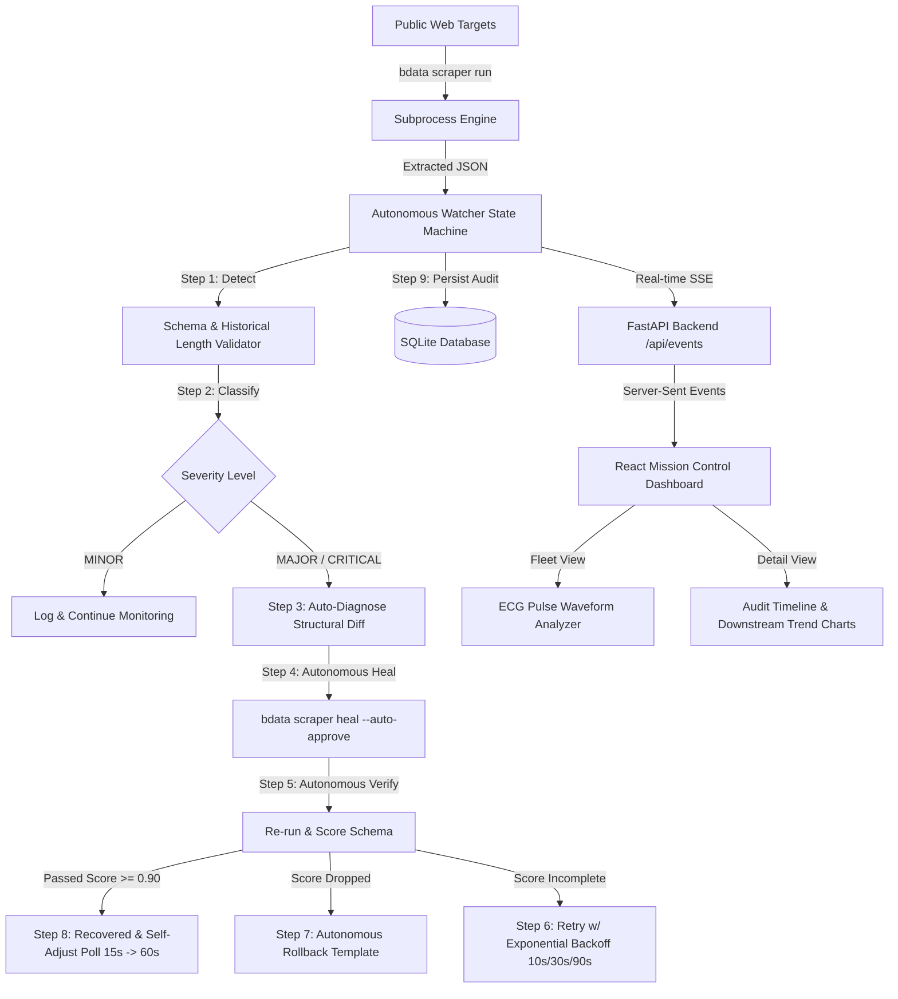

# 🛡️ Scraper Health Console
> **Fully Autonomous, Self-Healing, Multi-Collector Web Scraping Platform powered by Bright Data Scraper Studio**

Built for the **Bright Data Scraper Studio Hackathon**.

---

## 🚀 Problem Statement

Web scrapers work fine during testing, then **break silently in production** when target HTML structures shift. Scrapers don't crash outright — they quietly return empty, null, or corrupt data, causing silent downstream failures.

**Scraper Health Console** eliminates silent scraper rot. The moment a scraper degrades, the console:
1. **Detects** field missingness, type corruption, or length anomalies
2. **Classifies Severity** (`MINOR`, `MAJOR`, `CRITICAL`)
3. **Auto-Diagnoses** root cause by comparing structural JSON diffs against stored SQLite baselines
4. **Heals Autonomously** via `@brightdata/cli` (`bdata scraper heal ... --auto-approve --auto-save`)
5. **Verifies Fixes** immediately via post-heal re-extraction
6. **Retries with Exponential Backoff** (10s, 30s, 90s) & refined prompts if initial heal fails
7. **Rolls Back** template if validation score worsens
8. **Self-Adjusts Poll Intervals** (tightens post-heal to 15s, relaxes to baseline after 3 healthy runs)
9. **Persists Full Audit Trail** documenting every decision step with reasoning text

---

## ⚡ Autonomy vs Manual Trigger

> [!IMPORTANT]
> **What is Autonomous vs What is Manual?**
> - **DEMO BREAK (`POST /api/scraper/{id}/demo-break`) is the ONLY manual trigger in the entire system.** This endpoint exists solely because a hackathon presentation cannot wait hours or days for a live public target site to alter its HTML layout naturally.
> - **100% of downstream actions are fully autonomous**: detection, severity classification, structural diff diagnosis generation, `bdata scraper heal` execution, post-heal verification, exponential retry backoff, template rollback, poll interval self-adjustment, audit logging, and webhook alerts require **ZERO human input**.

---

## 🏗️ System Architecture



---

## 🛠️ Tech Stack

- **CLI Scraper Engine**: Bright Data `@brightdata/cli` (`bdata scraper create`, `run`, `heal`)
- **Backend API**: Python 3.12, FastAPI, `aiosqlite`, `pydantic`, `httpx`
- **Database**: SQLite (`scraper_console.db`)
- **Frontend Dashboard**: React 18 (Vite), TypeScript, Tailwind CSS, Lucide Icons, Recharts
- **Real-Time Stream**: Server-Sent Events (SSE)
- **CI / CD**: GitHub Actions (`.github/workflows/autonomous_watcher.yml`)

---

## 🖥️ Getting Started

### Prerequisites
- Node.js v20+ & npm
- Python 3.12+ & pip
- Bright Data CLI:
  ```bash
  npm install -g @brightdata/cli
  bdata login
  ```

### 1. Backend Setup
```bash
cd backend
pip install -r requirements.txt
python -m uvicorn app.main:app --reload --port 8000
```
*API server will start at `http://localhost:8000`. SQLite DB is created and seeded automatically.*

### 2. Frontend Setup
```bash
cd frontend
npm install
npm run dev
```
*Dashboard will launch at `http://localhost:5173`.*

---

## 🎥 Live Demo Guide (Demo Break Walkthrough)

1. Open the dashboard at `http://localhost:5173`.
2. Click **"INJECT DEMO BREAK"** in the top header or on any collector card.
3. Select a target collector (e.g. **Hacker News Tech Frontpage**) and choose a simulated break method:
   - **Required Field Stripped (Empty String)**
   - **Data Type Corruption**
   - **Short Text Anomaly**
   - **Total Failure / Zero Items**
4. Click **"ARM DEMO BREAK"**.
5. Watch the dashboard react in real time:
   - The collector's ECG pulse transforms from **green steady heartbeat** to **red flatline spike** -> **purple searching waveform** -> **cyan glowing recovered**.
   - The **Audit Timeline** streams code-generated structural JSON diffs and the exact `bdata scraper heal` prompt without human intervention.
   - The active poll interval tightens from `60s` to `15s` post-recovery before relaxing back to `60s`.

---

## 📡 Key API Endpoints

| Method | Endpoint | Description |
| :--- | :--- | :--- |
| `GET` | `/api/collectors` | List all collectors, statuses, & poll intervals |
| `POST` | `/api/collectors` | Register a new web scraper collector |
| `POST` | `/api/scraper/{id}/demo-break` | Arm synthetic demo break for live presentation |
| `GET` | `/api/events` | Real-time SSE stream of state machine transitions |
| `GET` | `/api/audit/{id}` | Persisted step-by-step decision log & prompt diffs |
| `GET | `/api/history/{id}` | Extraction run history powering downstream trends |
| `GET` | `/api/stats/{id}` | Uptime %, total heals, avg recovery time |
| `GET` | `/api/data/{id}/latest` | Downstream consumable clean JSON endpoint |
| `GET` | `/health` | Service health status |

---

## 📜 License
MIT License. Built for Bright Data Scraper Studio Hackathon.
